# AppConversor
Aplicación de conversión creado en Java como objetivo de "Alura CHALLENGES"

> 

Este conversor se desarrolló en el lenguaje Java utilizando la clase JOptionPane de la biblioteca Javax
y  el método showInputDialog como un objeto para presentar más de una opción.

El cuadro de diálogo menú permite al usuario seleccionar entre las opciones de conversión, 
según sea el requerido en un conversor de divisas o el conversor de temperatura.

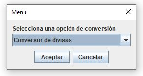

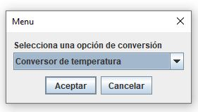

#### Funcionalidades

El conversor de divisas muestra las siguientes opciones:
- Convertir de Pesos a Dólar
- Convertir de Pesos  a Euros
- Convertir de Pesos  a Libras Esterlinas
- Convertir de Pesos  a Yen Japonés
- Convertir de Pesos a Won sur-coreano

Y luego muestra las opciones a la inversa:
  - Convertir de Dólar a Pesos
  - Convertir de Euros a Pesos
  - Convertir de Libras Esterlinas a Pesos
  - Convertir de Yen Japonés a Pesos
  - Convertir de Won sur-coreano a Pesos
 
La siguiente ventana el usuario ingresa la cantidad de divisas, da click en aceptar y el conversor envía un mensaje del valor convertido a la divisa seleccionada.

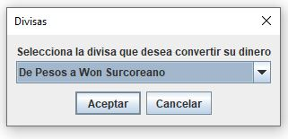

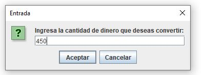

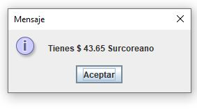

El conversor de temperatura muestra las diferentes opciones:

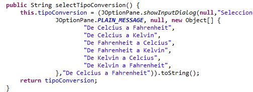

Al seleccionar una opción de temperatura el usuario ingresa un valor y al dar click en aceptar se muestra el mensaje con un nuevo valor.

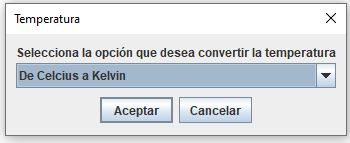

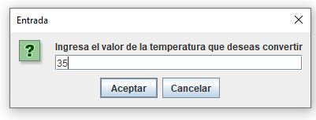

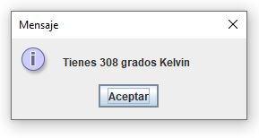

Luego el usuario selecciona si desea continuar o no y muestran las ventanas de diálogo

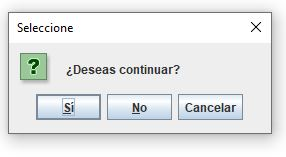

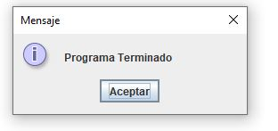
